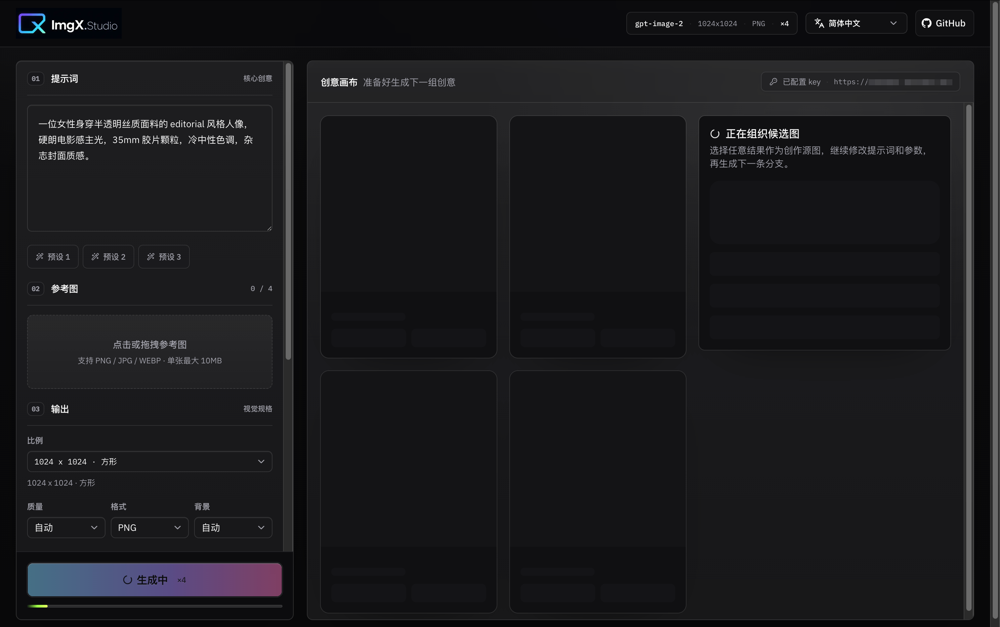
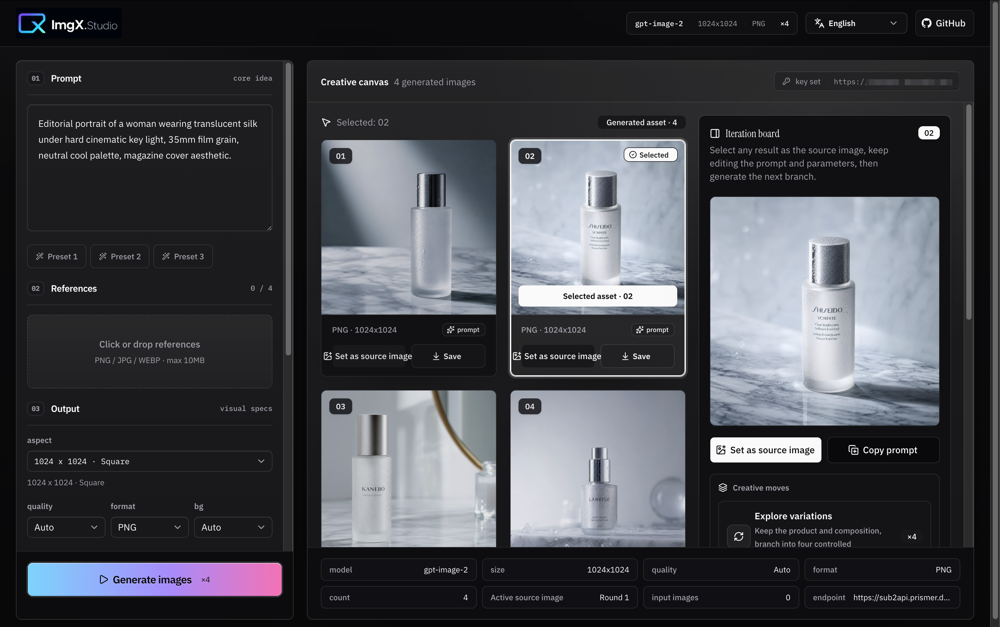
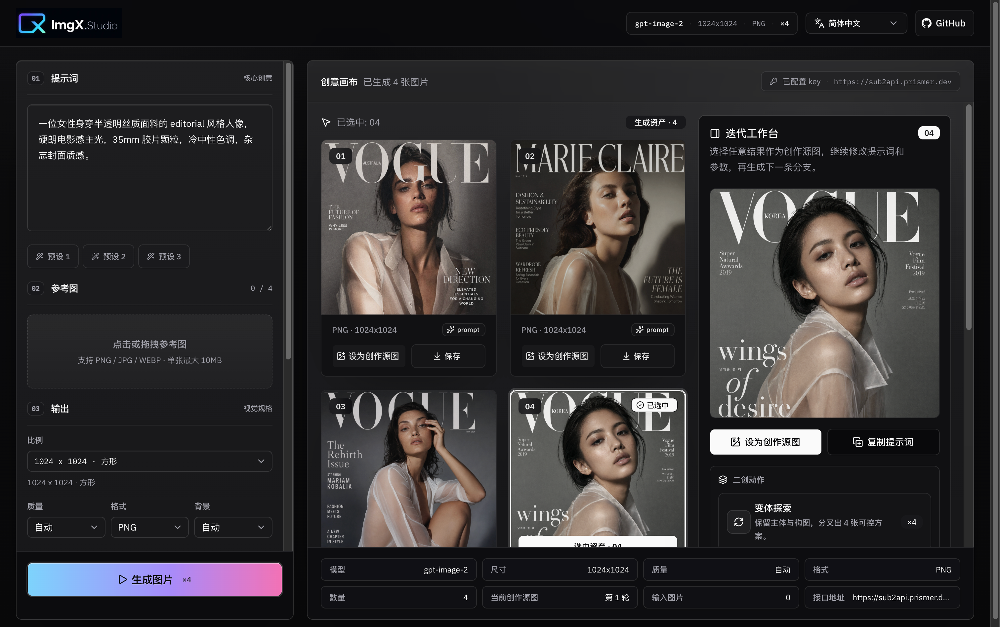

# ImgX Studio

> 面向设计师、营销团队和 AI 创作者的自托管 GPT 图片工作台，把 gpt-image-2 变成可迭代、可交付的创意生产工具。


**阅读语言：** [English](./README.md) | [简体中文](./README.zh-CN.md) | [繁體中文](./README.zh-TW.md) | [日本語](./README.ja.md) | [한국어](./README.ko.md) | [Español](./README.es.md) | [Français](./README.fr.md) | [Deutsch](./README.de.md) | [Português](./README.pt.md)

## 把 GPT Image 变成真正的创意工作台

ImgX Studio 是一个面向 **设计师、品牌营销、独立开发者和 AI 图片工作流团队** 的 GPT 图片生成 WebUI。它把 GPT Image / OpenAI-compatible image API 包装成更顺手的可视化产品：写 prompt、上传参考图、选择尺寸和质量、批量出图、挑选结果、继续二创，一条链路完成。

它不是一个只负责「发请求」的 demo，而是一个可以直接部署、可以自定义、适合产品图/主视觉/电商图/灵感探索的 **gpt-image-2 WebUI 起点**。

## 产品截图

<p align="center">
  
</p>

<p align="center">
  
</p>

<p align="center">
  
</p>

## 为什么值得 Star

| 你需要 | ImgX Studio 提供 |
| --- | --- |
| 更像产品的图片生成界面 | 现代化 Next.js 界面，参数区、生成区、迭代区围绕真实创作流程设计。 |
| 更稳定的多图输出 | 选择 1-4 张图片时逐张请求，减少接口批量限制导致的少图问题。 |
| 文生图 + 图生图 | 可从提示词开始，也可上传最多 4 张参考图做编辑、延展和变体。 |
| 持续迭代，而不是一次性 prompt | 选中生成结果后可设为下一轮源图，继续精修、高清化或做风格分叉。 |
| 直连 / 代理两种模式 | 浏览器直连 API，或通过 `/api/images` 服务端代理隐藏团队 Key。 |
| OpenAI-compatible 接口 | Base URL 会自动规整到 `/v1/images/generations` 或 `/v1/images/edits`。 |
| 多语言开箱即用 | 界面和文档覆盖 9 种语言，适合面向国际用户或团队内部部署。 |

## 适合用来做什么

| 场景 | 你可以怎么用 |
| --- | --- |
| 产品主视觉 | 上传产品图，生成高端电商图、广告图、社媒封面。 |
| 创意探索 | 一次生成多张候选图，快速比较方向，再从最佳图继续分叉。 |
| 商业精修 | 以结果图为源图继续清理瑕疵、强化材质、改善光影。 |
| 变体分叉 | 保持主体和构图，探索不同背景、角度、风格与氛围。 |
| 私有部署 | 自己部署到服务器或 Vercel，作为团队内部 AI 图片工具。 |

## 核心能力

- **为 gpt-image-2 打造**：内置 `gpt-image-2`、`gpt-image-2-2026-04-21`、`gpt-image-1` 模型选项。
- **参考图工作流**：支持 PNG / JPG / WEBP，最多 4 张，单张最大 10MB。
- **迭代工作台**：将任意生成结果设为当前创作源图，继续生成下一条分支。
- **二创动作**：内置变体探索、商业精修、高清主视觉、局部重绘等创作指令。
- **输出控制**：支持智能、方形、横版、竖版、2K、4K、自定义尺寸，单边 64-8192 px。
- **交付格式**：支持 PNG、JPEG、WEBP，以及自动、不透明、透明背景模式。
- **隐私友好**：连接信息只保存在当前浏览器本地，也可用服务端 `OPENAI_API_KEY` 管理团队 Key。

## 技术栈

- [Next.js 16](https://nextjs.org/) + React 19
- TypeScript
- Tailwind CSS 4
- shadcn/ui + Base UI
- OpenAI Node SDK
- Sonner Toast

## 快速开始

### 1. 克隆项目

```bash
git clone <your-repo-url>
cd gpt-image-2-webui
```

### 2. 安装依赖

```bash
npm install
```

### 3. 配置环境变量

如果你只使用 **浏览器直连** 模式，可以不配置服务端环境变量，直接在页面里填写 API Key。

如果你想使用 **服务端代理** 模式，复制环境变量文件：

```bash
cp .env.example .env.local
```

然后填写：

```bash
OPENAI_API_KEY=sk-...
```

### 4. 启动开发服务

```bash
npm run dev
```

打开 [http://localhost:3000](http://localhost:3000) 即可使用。

## 使用方式

1. 在 Prompt 区域输入创意描述，或点击内置预设。
2. 按需上传 PNG / JPG / WEBP 参考图，最多 4 张，单张最大 10MB。
3. 选择输出尺寸、质量、格式、背景和图片数量。
4. 在 Connection 区域选择请求模式：
   - **Browser direct**：浏览器直接请求接口，需要目标 endpoint 支持 CORS。
   - **Server proxy**：通过 `/api/images` 转发，可使用服务端 `OPENAI_API_KEY`。
5. 生成后选择最满意的一张，可下载，也可设为源图继续二创。

## 环境变量

| 变量 | 必填 | 说明 |
| --- | --- | --- |
| `OPENAI_API_KEY` | 否 | 服务端代理模式使用。页面填写的 Key 优先；未填写时会使用该环境变量。 |
| `NEXT_ASSET_PREFIX` | 否 | 为静态资源设置 asset prefix，适合部署到带子路径/CDN 的环境。 |

## 部署

### Vercel

1. Fork 本项目。
2. 在 Vercel 导入仓库。
3. 如需服务端代理模式，在 Vercel Project Settings 中添加 `OPENAI_API_KEY`。
4. 部署完成后访问项目域名。

### Node.js / Docker 场景

项目已开启 Next.js `standalone` 输出：

```bash
npm run build
npm run start
```

## API Key 与隐私说明

- 浏览器直连模式下，API Key 会从浏览器发往你配置的 endpoint。
- 勾选 **Remember on this device** 时，API Key 和 Base URL 仅保存在当前浏览器的 `localStorage`。
- 服务端代理模式可以通过环境变量 `OPENAI_API_KEY` 在服务端保存 Key，避免团队成员在页面中重复填写。

## 路线图

- [ ] 生成历史记录
- [ ] Prompt 模板管理
- [ ] 项目/画布分组
- [ ] 更多模型供应商预设
- [ ] Dockerfile 与一键部署模板

## 贡献

欢迎提交 Issue 和 Pull Request，尤其是新的兼容接口适配、更好的 prompt preset、多语言文案优化、工作流体验改进和部署示例。

如果这个项目帮你节省了搭建 gpt-image-2 WebUI 的时间，欢迎点一个 Star，也欢迎把它分享给正在做 AI 图片工作流的朋友。

## License

当前仓库尚未包含 License 文件。正式开源前建议补充 MIT、Apache-2.0 或你偏好的开源许可证。
